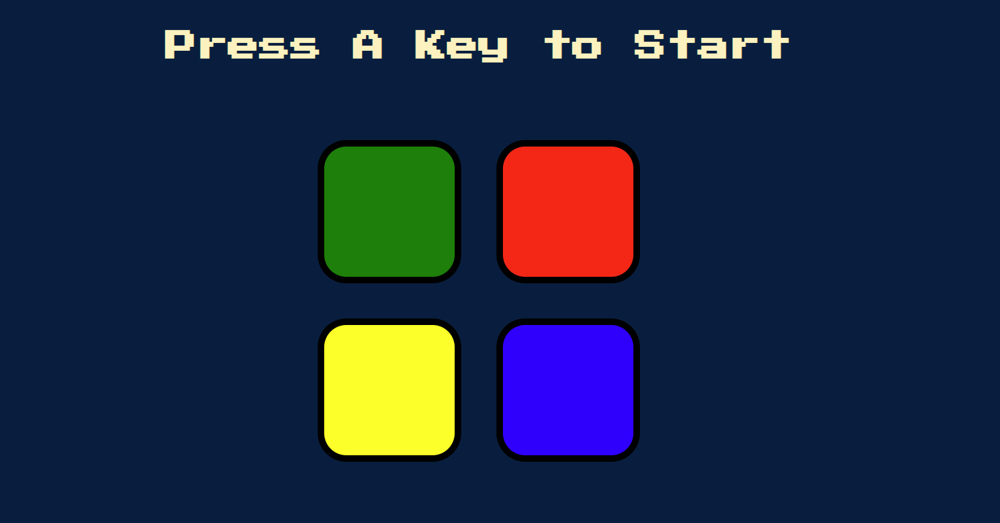
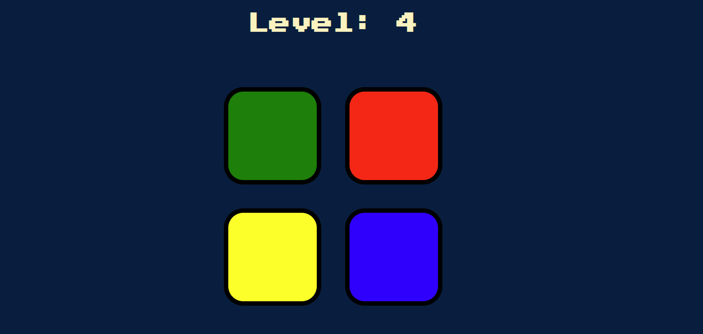
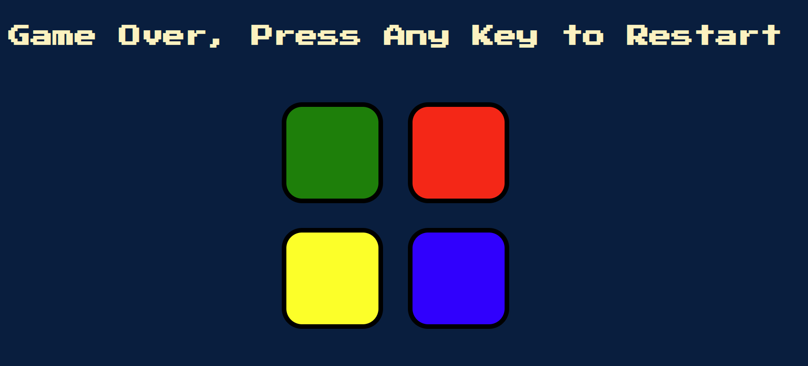

# Simon Game

Welcome to the Simon Game repository! This is a simple and classic game built with HTML, CSS, and JavaScript (jQuery).

## Deployment

You can play the game online by visiting the following link: [Simon Game](https://omrip500.github.io/symon/)

## Technologies Used

- **HTML:** The structure of the game is built using HTML.
- **CSS:** Styling and layout are done with CSS to make the game visually appealing.
- **JavaScript (jQuery):** The game logic and interactivity are implemented using JavaScript, with jQuery for simplified DOM manipulation.

## How to Play

1. **Objective:** The goal of the game is to repeat a sequence of colors and sounds generated by the computer.

2. **Start:** Press the "A" key to initiate the game.

Feel free to explore the code and have fun playing the Simon Game!

## Screenshots

_Home Screen_

_Level 4_

_Game Over_
